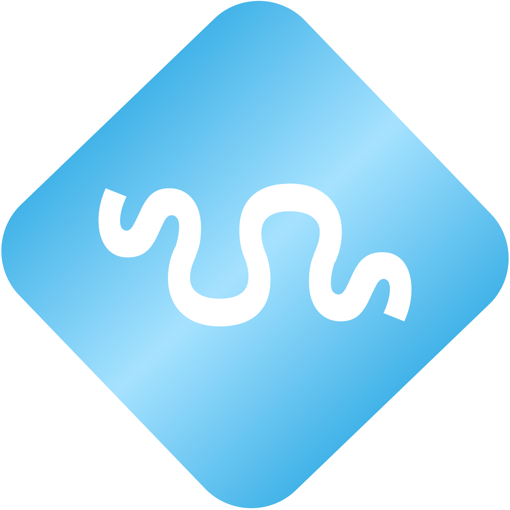
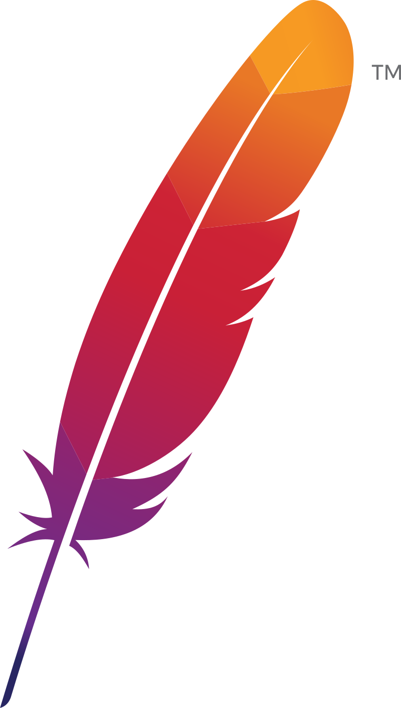

<h1 align="left" >
 	
	SoftCoders
</h1>

## Tecnologías usadas
<h3 align="left" >
 	Apache Maven
	
</h3>

Maven es un gestor de proyectos basado en el concepto *Project Object Model* (POM) que nos permitirá ahorrar tiempo a la hora de construir nuestra aplicación. Con él podremos compilar, montar, ejecutar y testear nuestro programa; además, gracias a su sistema de control de dependencias simplificará en gran medida el tiempo de desarrollo a la hora de indicar las bibliotecas que usaremos.

A su vez, con el control de versiones implementado de manera nativa en Maven, podremos reflejar la version de nuestro proyecto, además de en nuestro repositorio remoto en Github, en la propia aplicación. Se puede consultar todo acerca de cómo enumeramos las versiones [aquí](CONTRIBUTING.md).

## Metodología organizacional SCROM
> **SCROM**: Soft Coders Realistic Organizational Model

### Distribución del trabajo
> En este proyecto se han dividido los períodos de entregas en 2 subsecciones con objetivos diferentes para maximizar la eficiencia.
- Master period: Subsección inicial del período de entrega. El objetivo es comprender todos los aspectos teóricos necesarios para realizar la entrega de forma satisfactoria.
- Development period: Subsección final del período de entrega. El objetivo es centrar la atención y esfuerzos en desarrollar el producto requerido para la entrega.

### COMEETS
> Las *COMEETS* son reuniones surgidas como resultado de unificar los workflows a seguir en sprint reviews y scrum meetings.
El procedimiento a seguir es el siguiente:
> 	- Pre-COMEET: se refiere al día inmediatamente anterior al COMEET.
> 	- Post-COMEET: denota todos los días después del COMEET hasta el día previo al siguiente.
El procedimiento a seguir es el siguiente:

1. Pre-COMEET:
	- Comeeter prepara la COMEET y revisa tareas en incubadora.
	- El resto crea y sube sus actas personales a `ABD/docs/hoy/`  en `branch: actas`.
2. COMEET:
	1. Actas.
		- Exposición individual de respuestas a las dos preguntas básicas:
			- ¿Qué has hecho hasta ahora?
			- ¿Con qué problemas te has encontrado?
		- Unificación de las actas (a realizar por el Comeeter).
	2. Resolución de Pull Requests pendientes.
	3. Lista de temas.
		- Establecer las cuestiones a tratar en la reunión.
		- Debatir cada uno de los puntos de la lista de forma ordenada hasta solucionarlos.
	4. Asignar tareas: establecer fecha y encargado.
3. Post-COMEET:
	- Cada miembro realiza las tareas asignadas en el COMEET.
	- Se añaden a la incubadora (tanto en GitHub como en Discord) todos los posibles temas a tratar en el futuro.

#### Resolución de conflictos entre COMEETS
- Solo altera mi trabajo:
  - Se puede informar mediante Discord o Whatsapp.
  - Lo resuelve la persona implicada de manera independiente.
- Altera el trabajo de alguien más:
  - Muy grave:
    1. Crea un Issue en GitHub.
    2. Notifaca a las personas implicadas directamente.
    3. Se establece reunión de emergencia entre las personas implicadas para resolver el conflicto.
  - Moderadamente grave:
    1. Crea un issue en GitHub tageando a las personas implicadas, tanto en título como en cuerpo.
    2. Se resuelve de manera asícrona cuando sea posible.
  - Nada grave:
    1. Se notifica por el canal general de Discord o Whatsapp (opcional).
    2. Se discute en el próximo COMEET preferiblemente.

---

<h1 align="center" >
 	
	
	SoftCoders
</h1>

Licensed under the [MIT License](LICENSE).
